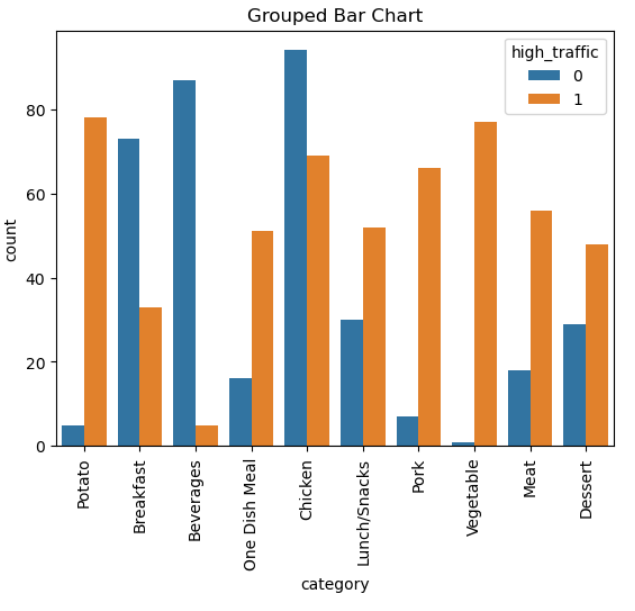
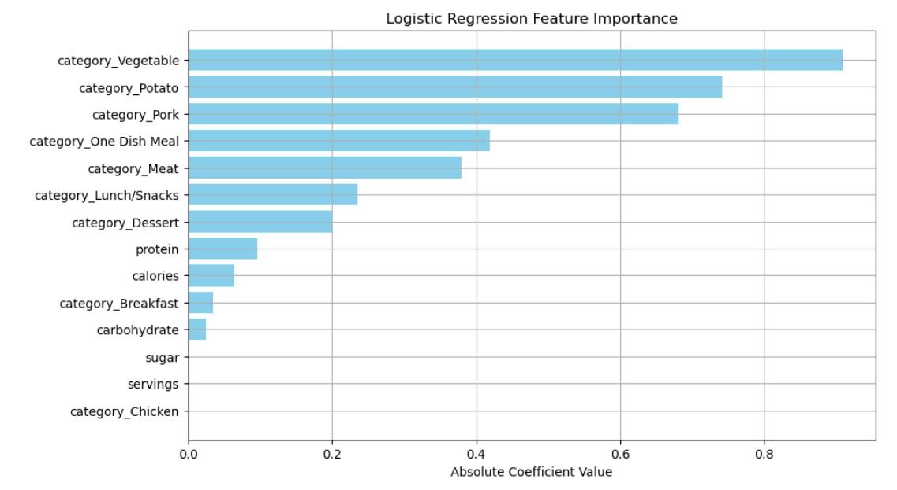

# 🍽️ Predicting Recipe Popularity 
A machine learning project that aims to predict whether a recipe will receive **high** or **low** web traffic based on nutritional information and recipe category.

---

## 🔧 Business Context & Objective

This project was developed in response to a simulated business challenge posed by the content team responsible for selecting homepage recipes.

> _"We’ve noticed that website traffic increases by up to 40% when a **popular recipe** is displayed on the homepage. But we don’t know how to **predict popularity**. Can your team help us **correctly predict high traffic recipes 80% of the time**?"_

The goal was to:
- ✅ **Predict which recipes will lead to high traffic**
- ✅ **Correctly identify popular recipes at least 80% of the time** (i.e., ≥ **80% precision**)

---

This project also served as the **capstone for my DataCamp Data Scientist Certification**. It applies the full data science workflow to a real-world problem, from data cleaning and exploration to modeling, evaluation, and business recommendations.

---

## 📊 Project Overview

This project uses a dataset of recipe web traffic along with nutritional and categorical data. A **binary classification model** is developed to predict if a recipe will generate **high user engagement**.

### ✅ Business Goal

To **minimize the chance of showing unpopular recipes**, the model must **achieve at least 80% precision** for predicting high-traffic recipes. That is, at least 80% of the recipes predicted to be "popular" should actually generate high traffic.

---

## 📊 Recipe Dataset Description

This dataset contains nutritional and categorical information for a variety of recipes.

### Features

- **recipe**: Unique numeric identifier for each recipe.
- **calories**: Total number of calories per recipe.
- **carbohydrate**: Amount of carbohydrates (in grams).
- **sugar**: Amount of sugar (in grams).
- **protein**: Amount of protein (in grams).
- **category**: Type of recipe, grouped into one of ten categories:
  - 'Lunch/Snacks', 'Beverages', 'Potato', 'Vegetable', 'Meat', 'Chicken', 'Pork', 'Dessert', 'Breakfast', 'One Dish Meal'.
- **servings**: Number of servings the recipe yields.
- **high_traffic**: Indicates whether the recipe was featured during high site traffic periods (`"High"` if so).

## 🧹 Data Cleaning & Preprocessing

- Dropped 5.5% of records with missing nutritional values (`calories`, `protein`, `carbohydrate`, `sugar`)
- Replaced `NaN` values in `high_traffic` with `"Low"` to reflect actual engagement level
- Converted categorical `category` column to dummy variables
- Cleaned `"Chicken Breast"` category to `"Chicken"`
- Transformed text-based `servings` values like `"4 as a snack"` into integers
- Verified and coerced all numeric columns

---

## 📈 Exploratory Data Analysis (EDA)

- **Distribution Analysis**: Most numeric features are right-skewed
- **Traffic Class Balance**: Slightly imbalanced, but suitable for modeling
- **Correlation Analysis**: Weak correlations across features
- **Category Insights**: Categories like `Potato`, `Vegetable`, and `Pork` are associated with higher traffic
- **Pairplots** & **Boxplots**: No strong multivariate trends found

> 

---

## 🤖 Modeling & Evaluation

### Models Used

- **Logistic Regression** (baseline & tuned)
- **Decision Tree Classifier**

### Initial Results

| Metric      | Logistic Regression | Decision Tree |
|-------------|---------------------|---------------|
| Precision   | 78%                 | 78%           |
| Recall      | 81%                 | 79%           |
| Accuracy    | 75%                 | 74%           |

### ✅ Final Tuned Model (Logistic Regression)

- **Precision (High Traffic)**: **85%** ✅
- **Recall**: 56%
- **F1 Score**: 67%
- **Model Type**: Logistic Regression with L1 regularization (`liblinear`), `C=0.1`, and `class_weight='balanced'`

This meets the business requirement of precision ≥ 80%.

---

## 🔍 Feature Importance

Key predictors of recipe popularity:

- `category_Potato`, `category_Pork`, `category_Vegetable`, `category_One Dish Meal`
- Nutritional features had **minor impact** on engagement
- `category_Chicken` was **least influential**

> 

---

## 🛠️ Tech Stack

- **Python**
- **Pandas**, **NumPy**, **Seaborn**, **Matplotlib**
- **Scikit-learn** for modeling and hyperparameter tuning
- **Jupyter Notebook** for data exploration and analysis
